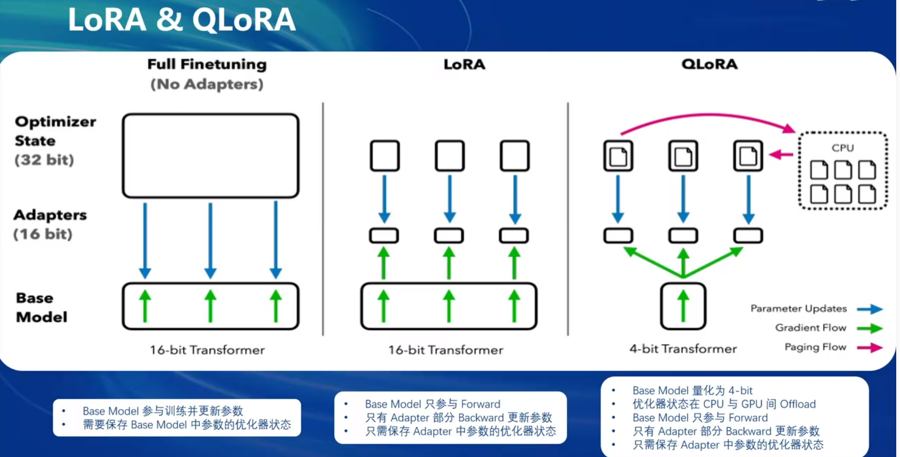
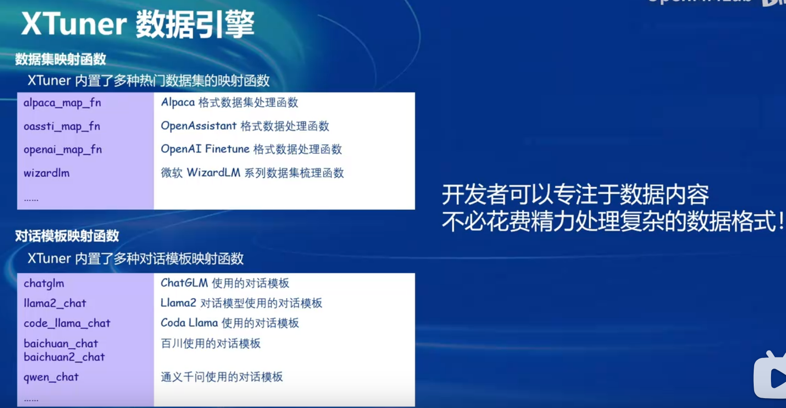

# InternLM2-Tutorial-Assignment-Lecture5  
# 第5课 XTuner 微调 LLM：1.8B、多模态和 Agent   
2024.4.11  XTuner 贡献者 李剑锋 汪周谦 王群    

[XTuner]( https://github.com/InternLM/XTuner)   
[第6课 视频]( https://b23.tv/QUhT6ni)   
[第6课 文档](https://github.com/InternLM/Tutorial/blob/camp2/xtuner/personal_assistant_document.md)   
[第6课 文档](https://github.com/InternLM/Tutorial/blob/camp2/xtuner/readme.md)   
[第6课 作业](https://github.com/InternLM/Tutorial/blob/camp2/xtuner/homework.md)    
[OpenXLab 部署教程](https://github.com/InternLM/Tutorial/tree/camp2/tools/openxlab-deploy)    

## 第6课 笔记   

### 1. 原理
- 为什么要微调调大模型： 现有的模型是基座模型 Foundation Model

- Finetune二种范式：增量预训练微调 和 指令跟随微调

- 一条数据的一生：
  - 原始数据
  - 标准格式数据 system user assistant
  - 添加对话模板  system input output 对话模版是为了能够让LLM区分出system user和assistant，不同的模型会有不同的模版。
  - Tokenized数据
  - 添加Label

   

   

- 微调的方案：
  - LoRA: Low-Rank Adapation of Large Lanaguage Models  比喻超大玩具（基底模型）中的某个零件(LoRA)进行改动
  - QLoRA 是LoRA的一种改进，类似有一把生锈的螺丝刀，也能改造玩具

### 2. XTuner   

- XTuner是以配置文件的形式专封装了大部分微调场景，对于0基础的非专业人员也能微调模型；轻量化，对于7B参数量的LLM，最小显存为8GB，消费级显卡就可以微调模型。

- XTuner适配多种生态，多种硬件.

- 与LLaMa-Factory相比，训练速度更快，微调效果更好。

- XTuner快速上手
  - 创建Conda环境
  - 安装XTuner: `pip install xtuner`
  - 挑选配置模板: `xtuner list-cfg -p internlm_20b`
  - 一键训练: `xtuner train internlm_20b_qlora_oasst1_512_e3`
  - 对话：Float16 模型对话 4bit模型对话 加载Adapter模型对话 工具类对话（网络搜素 计算器 解方程函数）  

- XTuner 数据引擎
  - 数据集映射函数 **开发者可以专注于数据内容，不必花费精力处理复杂的数据格式！**
  - 多数据拼接
 

### 3. 8GB显存玩转LLM

- XTuner二种加速优化方案：Flash Attention 和 DeepSpeed ZeRO
- 优化后，可以明显减少显存的占用。

### 4. InternLM2 1.8B 模型

- 三个版本开源模型：
    - InternLM2-1.8B : 基础模型，为下游深度适应提供了良好的起点；
    - InternLM2-chat-1.8B-SFT : 在InternLM2-1.8B 上进行监督微调（SFT）后得到的对话模型；
    - **InternLM2-Chat-1.8B** :   通过在线RLHF 在InternLM2-chat-1.8B-SFT 之上进一步对齐，表现出更好的指令跟随、聊天体验和函数调用，模型大小为3.78G,

### 5. 多模态LLM     

- 给LLM装上电子眼，多模态是识图，不是生图，
- LLaVA方案 Image Projector
- 快速上手

## 第6课 作业   

