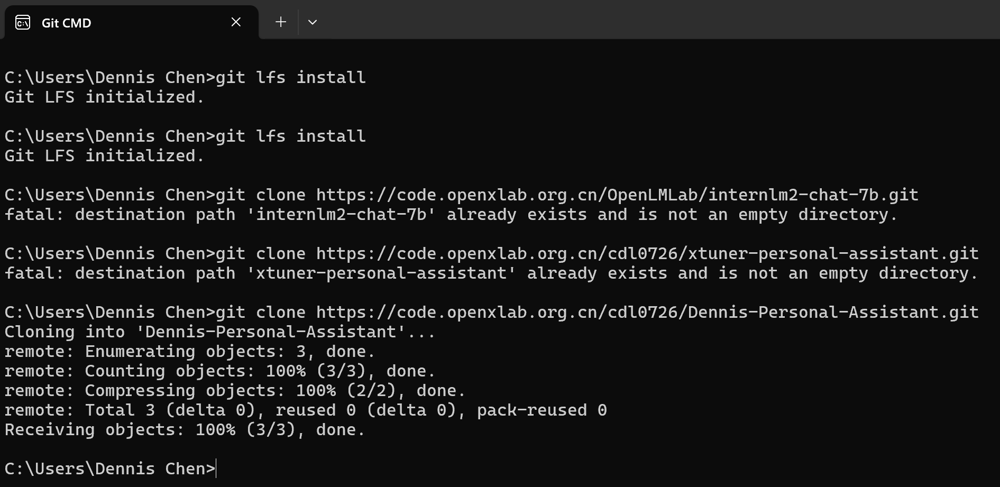

# InternLM2-Tutorial-Assignment-Lecture4  
# 第4课 XTuner 微调 LLM：1.8B、多模态和 Agent     
2024.4.11  XTuner 贡献者 李剑锋 汪周谦 王群    

[XTuner]( https://github.com/InternLM/XTuner)   
[第4课 视频]( https://b23.tv/QUhT6ni)   
[第4课 文档](https://github.com/InternLM/Tutorial/blob/camp2/xtuner/personal_assistant_document.md)   
[第4课 文档](https://github.com/InternLM/Tutorial/blob/camp2/xtuner/readme.md)   
[第4课 作业](https://github.com/InternLM/Tutorial/blob/camp2/xtuner/homework.md)    
[OpenXLab 部署教程](https://github.com/InternLM/Tutorial/tree/camp2/tools/openxlab-deploy)    

# 第4课 笔记   

## 1. 原理
- 为什么要微调调大模型： 现有的模型是基座模型 Foundation Model

- Finetune二种范式：增量预训练微调 和 指令跟随微调

   
 
- 一条数据的一生：
  - 原始数据
  - 标准格式数据 system user assistant
  - 添加对话模板  system input output 对话模版是为了能够让LLM区分出system user和assistant，不同的模型会有不同的模版。
  - Tokenized数据
  - 添加Label

  

- 微调的方案：
  - LoRA: Low-Rank Adapation of Large Lanaguage Models  比喻超大玩具（基底模型）中的某个零件(LoRA)进行改动
  - QLoRA 是LoRA的一种改进，类似有一把生锈的螺丝刀，也能改造玩具


## 2. XTuner   

- XTuner是以配置文件的形式专封装了大部分微调场景，对于0基础的非专业人员也能微调模型；轻量化，对于7B参数量的LLM，最小显存为8GB，消费级显卡就可以微调模型。

- XTuner适配多种生态，多种硬件.

- 与LLaMa-Factory相比，训练速度更快，微调效果更好。

 


   

- XTuner快速上手
  - 创建Conda环境
  - 安装XTuner: `pip install xtuner`
  - 挑选配置模板: `xtuner list-cfg -p internlm_20b`
  - 一键训练: `xtuner train internlm_20b_qlora_oasst1_512_e3`
  - 对话：Float16 模型对话 4bit模型对话 加载Adapter模型对话 工具类对话（网络搜素 计算器 解方程函数） 


    

- XTuner 数据引擎
  - 数据集映射函数 **开发者可以专注于数据内容，不必花费精力处理复杂的数据格式！**
  - 多数据拼接
    


## 3. 8GB显存玩转LLM

- XTuner二种加速优化方案：Flash Attention 和 DeepSpeed ZeRO
- 优化后，可以明显减少显存的占用。

## 4. InternLM2 1.8B 模型

- 三个版本开源模型：
    - InternLM2-1.8B : 基础模型，为下游深度适应提供了良好的起点；
    - InternLM2-chat-1.8B-SFT : 在InternLM2-1.8B 上进行监督微调（SFT）后得到的对话模型；
    - **InternLM2-Chat-1.8B** :   通过在线RLHF 在InternLM2-chat-1.8B-SFT 之上进一步对齐，表现出更好的指令跟随、聊天体验和函数调用，模型大小为3.78G,

## 5. 多模态LLM     

- 给LLM装上电子眼，多模态是识图，不是生图，
- LLaVA方案 Image Projector
- 快速上手


# XTuner 微调个人小助手认知

如何利用 XTuner 完成个人小助手的微调！

## 1 开发机准备

使用 `Cuda11.7-conda` 镜像，然后在资源配置中，使用 `10% A100 * 1` 的选项，创建开发机器。   

## 2 快速上手    

### 2.1 环境安装    

- 安装一个 XTuner：`studio-conda xtuner0.1.17`
- 激活环境: `conda activate xtuner0.1.17`
- 进入家目录: `cd ~`
- 创建版本文件夹并进入: `mkdir -p /root/xtuner0117 && cd /root/xtuner0117`
- 拉取 0.1.17 的版本源码:  `git clone -b v0.1.17  https://github.com/InternLM/xtuner`
- 进入源码目录: ` cd /root/xtuner0117/xtuner`
- 从源码安装 XTuner: `pip install -e '.[all]'`
  
    
  

### 2.2 前期准备    

#### 2.2.1 数据集准备

首先我们先创建一个文件夹来存放我们这次训练所需要的所有文件。    
```
# 前半部分是创建一个文件夹，后半部分是进入该文件夹。
mkdir -p /root/ft && cd /root/ft

# 在ft这个文件夹里再创建一个存放数据的data文件夹
mkdir -p /root/ft/data && cd /root/ft/data
```

在 data 目录下新建一个 generate_data.py 文件，将以下代码复制进去，然后运行该脚本即可生成数据集。
假如想要加大剂量让他能够完完全全认识到你的身份，那我们可以吧 `n` 的值调大一点。
```
# 创建 `generate_data.py` 文件
touch /root/ft/data/generate_data.py
```

打开该 python 文件后将下面的内容复制进去: 
```
import json

# 设置用户的名字
name = '不要姜葱蒜大佬'
# 设置需要重复添加的数据次数
n =  10000
.....
```
将文件 name 后面的内容修改为你的名称。
```
# 将对应的name进行修改（在第4行的位置）
- name = '不要姜葱蒜大佬'
+ name = "德林大佬"
```

修改完成后运行 generate_data.py 文件即可。    
```
# 确保先进入该文件夹
cd /root/ft/data

# 运行代码
python /root/ft/data/generate_data.py
```
可以看到在data的路径下便生成了一个名为 personal_assistant.json 的文件，这样我们最可用于微调的数据集就准备好啦！
里面就包含了 5000 条 input 和 output 的数据对。假如 我们认为 5000 条不够的话也可以调整文件中第6行 n 的值哦！

 

#### 2.2.2 模型准备   

准备好了数据集后，接下来我们就需要准备好我们的要用于微调的模型。
小模型 `InterLM2-Chat-1.8B` 来完成此次的微调.

在 InternStudio 上运行，直接通过以下代码一键创建文件夹并将所有文件复制进去。
（不用通过 OpenXLab 或者 Modelscope 进行模型的下载）
```
# 创建目标文件夹，确保它存在。
# -p选项意味着如果上级目录不存在也会一并创建，且如果目标文件夹已存在则不会报错。
mkdir -p /root/ft/model

# 复制内容到目标文件夹。-r选项表示递归复制整个文件夹。
cp -r /root/share/new_models/Shanghai_AI_Laboratory/internlm2-chat-1_8b/* /root/ft/model/
```

可以看到在 model 文件夹下保存了模型的相关文件和内容了。

   

#### 2.2.3 配置文件选择

在准备好了模型和数据集后，我们就要根据我们选择的微调方法方法结合前面的信息来找到与我们最匹配的配置文件了，从而减少我们对配置文件的修改量。   

**配置文件（config）**，其实是一种用于定义和控制模型训练和测试过程中各个方面的参数和设置的工具。   
准备好的配置文件只要运行起来就代表着模型就开始训练或者微调了。    

XTuner 提供多个开箱即用的配置文件，用户可以通过下列命令查看：    

`开箱即用意味着假如能够连接上 Huggingface 以及有足够的显存，其实就可以直接运行这些配置文件，XTuner就能够直接下载好这些模型和数据集然后开始进行微调`    

```
# 列出所有内置配置文件
# xtuner list-cfg

# 假如我们想找到 internlm2-1.8b 模型里支持的配置文件
xtuner list-cfg -p internlm2_1_8b
```
用到了第一个 XTuner 的工具 list-cfg ，
可以用来搜索特定模型的配置文件，比如例子中的 internlm2_1_8b ,也可以用来搜索像是微调方法 qlora 。 根据上面的定向搜索指令可以看到目前只有两个支持 internlm2-1.8B 的模型配置文件。如下图：

    

配置文件名的解释    
以 internlm2_1_8b_qlora_alpaca_e3 举例：
|模型名|说明|
|:-|:-|
|internlm12_1_8b|模型名称|
|qlora|使用的算法|
|alpaca|数据集名称|
|e3|把数据集跑3次|    

虽然我们用的数据集并不是 `alpaca` 而是我们自己通过脚本制作的小助手数据集 ，但是由于我们是通过 `QLoRA` 的方式对 `internlm2-chat-1.8b` 进行微调。而最相近的配置文件应该就是 `internlm2_1_8b_qlora_alpaca_e3` ，因此我们可以选择拷贝这个配置文件到当前目录：
```
# 创建一个存放 config 文件的文件夹
mkdir -p /root/ft/config

# 使用 XTuner 中的 copy-cfg 功能将 config 文件复制到指定的位置
xtuner copy-cfg internlm2_1_8b_qlora_alpaca_e3 /root/ft/config
```
这里我们就用到了 XTuner 工具箱中的第二个工具 `copy-cfg`
该工具有两个必须要填写的参数 {CONFIG_NAME} 和 {SAVE_PATH} ，在我们的输入的这个指令中，我们的 {CONFIG_NAME} 对应的是上面搜索到的 internlm2_1_8b_qlora_alpaca_e3 ,而 {SAVE_PATH} 则对应的是刚刚新建的 /root/ft/config。   
我们假如需要复制其他的配置文件只需要修改这两个参数即可实现。 输入后我们就能够看到在我们的 /root/ft/config 文件夹下有一个名为 internlm2_1_8b_qlora_alpaca_e3_copy.py 的文件了。如下图：

    

#### 2.2.4 小结        

完成以上内容后，我就已经完成了所有的准备工作:
 1. 在 GitHub 上克隆了 XTuner 的源码，并把相关的配套库也通过 pip 的方式进行了安装。
 2. 然后我们根据自己想要做的事情，利用脚本准备好了一份关于调教模型认识自己身份弟位的数据集。
 3. 再然后我们根据自己的显存及任务情况确定了使用 InternLM2-chat-1.8B 这个模型，并且将其复制到我们的文件夹里。
 4. 最后我们在 XTuner 已有的配置文件中，根据微调方法、数据集和模型挑选出最合适的配置文件并复制到我们新建的文件夹中。

经过了以上的步骤后，我们的 `ft `文件夹 如下：    

        

微调也经常被戏称为是炼丹!

### 2.3 配置文件修改   

在选择了一个最匹配的配置文件并准备好其他内容后，下面我们要做的事情就是根据我们自己的内容对该配置文件进行调整，使其能够满足我们实际训练的要求。    

通过折叠部分的修改，内容如下，可以直接将以下代码复制到 `/root/ft/config/internlm2_1_8b_qlora_alpaca_e3_copy.py` 文件中（先 `Ctrl + A` 选中所有文件并删除后再将代码复制进去）。    

完成了这部分的修改后，我们就可以正式的开始我们下一阶段的旅程： XTuner 启动~！   

### 2.4 模型训练    

#### 2.4.1 常规训练    
当我们准备好了配置文件好，我们只需要将使用 xtuner train 指令即可开始训练。    

我们可以通过添加 --work-dir 指定特定的文件保存位置，比如说就保存在 /root/ft/train 路径下。    
假如不添加的话模型训练的过程文件将默认保存在 `./work_dirs/internlm2_1_8b_qlora_alpaca_e3_copy` 的位置，就比如说我是在 `/root/ft/train` 的路径下输入该指令，那么我的文件保存的位置就是在 `/root/ft/train/work_dirs/internlm2_1_8b_qlora_alpaca_e3_copy` 的位置下。   

```
# 指定保存路径
xtuner train /root/ft/config/internlm2_1_8b_qlora_alpaca_e3_copy.py --work-dir /root/ft/train
```

#### 2.4.2 使用 deepspeed 来加速训练    

除此之外，我们也可以结合 XTuner 内置的 deepspeed 来加速整体的训练过程，共有三种不同的 deepspeed 类型可进行选择，分别是 `deepspeed_zero1`, `deepspeed_zero2` 和 `deepspeed_zero3`。   

#### 2.4.3 训练结果    

其实无论是用哪种方式进行训练，得到的结果都是大差不差的。我们由于设置了300轮评估一次，所以我们可以对比一下300轮和600轮的评估问题结果来看看差别。    

**300轮**


 **600轮**


### 2.5 模型转换、整合、测试及部署    

#### 2.5.1 模型转换

模型转换的本质其实就是将原本使用 Pytorch 训练出来的模型权重文件转换为目前通用的 Huggingface 格式文件，那么我们可以通过以下指令来实现一键转换。   

```
# 创建一个保存转换后 Huggingface 格式的文件夹
mkdir -p /root/ft/huggingface

# 模型转换
# xtuner convert pth_to_hf ${配置文件地址} ${权重文件地址} ${转换后模型保存地址}
xtuner convert pth_to_hf /root/ft/train/internlm2_1_8b_qlora_alpaca_e3_copy.py /root/ft/train/iter_768.pth /root/ft/huggingface
```

转换完成后，可以看到模型被转换为 Huggingface 中常用的 .bin 格式文件，这就代表着文件成功被转化为 Huggingface 格式了。   


   

**此时，huggingface 文件夹即为我们平时所理解的所谓 “LoRA 模型文件”**   

`可以简单理解：LoRA 模型文件 = Adapter`   

#### 2.5.2 模型整合    

对于 LoRA 或者 QLoRA 微调出来的模型其实并不是一个完整的模型，而是一个额外的层（adapter）。   
那么训练完的这个层最终还是要与原模型进行组合才能被正常的使用。   

而对于全量微调的模型（full）其实是不需要进行整合这一步的，因为全量微调修改的是原模型的权重而非微调一个新的 adapter ，因此是不需要进行模型整合的。   

 XTuner 提供了一键整合的指令，   
 但是在使用前我们需要准备好三个地址，包括原模型的地址、训练好的 adapter 层的地址（转为 Huggingface 格式后保存的部分）以及最终保存的地址。
 
```
# 创建一个名为 final_model 的文件夹存储整合后的模型文件
mkdir -p /root/ft/final_model

# 解决一下线程冲突的 Bug 
export MKL_SERVICE_FORCE_INTEL=1

# 进行模型整合
# xtuner convert merge  ${NAME_OR_PATH_TO_LLM} ${NAME_OR_PATH_TO_ADAPTER} ${SAVE_PATH} 
xtuner convert merge /root/ft/model /root/ft/huggingface /root/ft/final_model
```

整合完成后可以查看在 final_model 文件夹下的内容。

 
 

#### 2.5.3 对话测试    

XTuner 中也直接提供了一套基于 transformers 的对话代码   
我们可以直接在终端与 Huggingface 格式的模型进行对话操作。我们只需要准备我们刚刚转换好的模型路径并选择对应的提示词模版（prompt-template）即可进行对话。   

```
# 与模型进行对话
xtuner chat /root/ft/final_model --prompt-template internlm2_chat
```
通过一些简单的测试来看看微调后的模型的能力， 截图如下：   
    


------
# 第4课 作业   

记录复现过程并截图

# 基础作业（结营必做）

## 训练自己的小助手认知（记录复现过程并截图）

> !Tips
> Dennis德林的作业详见上述笔记：**XTuner 微调个人小助手认知**，结果截图如下：

   
 

# 进阶作业

## 模型上传到 OpenXLab  并将应用部署到 OpenXLab
  
### 1 OpenXLab·浦源平台介绍
[OpenXLab](https://openxlab.org.cn/openplatform?lang=zh-CN) 浦源平台以开源为核心，旨在构建开源开放的人工智能生态，促进学术成果的开放共享。OpenXLab面向 AI 研究员和开发者提供 AI 领域的一站式服务平台，包含数据集中心、模型中心和应用中心，致力于推动人工智能对产学研各领域全面赋能，为构建人工智能开放生态，推动人工智能科研与技术突破、交叉创新和产业落地提供全方位的平台支撑。     

    

### 2. 部署 InternLM2-Chat-1.8B 

在 OpenXLab 上部署一个 InternLM2-Chat-1.8B 的应用，具体步骤如下：   
  1. 模型准备
  2. 上传模型
  3. 编写代码
  4. 部署应用

        

部署工作使用的三个平台，可查看如下链接了解详情：    

- InternLM2 GitHub文档：https://github.com/InternLM/InternLM
- Gradio官方说明文档：https://www.gradio.app/docs/interface
- OpenXLab平台地址：https://openxlab.org.cn/home

**Reference**    

- [OpenXLab 平台介绍] (https://openxlab.org.cn/docs/intro.html)
- [OpenXLab Gradio 应用教程](https://openxlab.org.cn/docs/apps/Gradio%E5%BA%94%E7%94%A8.html)
- [OpenXLab 上传模型教程](https://openxlab.org.cn/docs/models/%E4%B8%8A%E4%BC%A0%E6%A8%A1%E5%9E%8B.html)

  
2.1 模型准备    

将模型下载到本地电脑：    


2.2 上传模型   

上传模型至 OpenXLab 模型中心的步骤如下:   

    

2.2.1 初始化 Git 配置   

Windows:

  1. 访问Git官方网站下载页面：[Git - Downloads](https://git-scm.com/downloads)
  2. 点击“Windows”下载Git安装程序。
  3. 运行下载的安装程序并按照向导指示完成安装。

配置 Git Username，用于作为 Git 提交的身份标识。  
```
git config --global user.name "cdl0726"
```
  *需要将 Username 替换成你在 OpenXLab 平台上的用户名*

配置 Git Email   
```
git config --global user.email "cdl0726@outlook.com"
```

2.2.2 拉取模型仓库    

   

首先需要在** OpenXLab 先创建一个空仓库**，填写模型仓库的基本信息，包括仓库名称、任务类型、访问权限等。   
创建完成空的模型仓库后，找到该仓库的 git 地址并拉取该空仓库至本地，空仓库的地址在模型文件的下载按钮.   


找到空仓库下的 git 地址，执行 git clone 操作  

```
git clone https://code.openxlab.org.cn/cdl0726/Dennis-Personal-Assistant.git
```


2.2.3 获取 Git Access Token   
在 OpenXLab 的密钥管理添加 Git 令牌   
进入密钥管理页面，点击添加令牌，输入一个令牌名称和选择可写的权限，如下图所示 


添加完令牌后，记得复制生成的 Access Token，如下图所示，在后续上传模型文件，执行git push 命令时会需要填入 Username 和 Access Token 信息  


2.2.4 上传模型文件   

在克隆的仓库目录中整理模型文件，即将你的模型文件放入至clone的目录中，并执行git push命令将模型推送至远程仓库   

**LFS管理大文件：** 使用 git lfs track 命令来标记你希望通过 Git LFS 管理的大文件。例如，您想要通过LFS管理所有的 .bin和 .model的模型文件，可以使用以下命令：   
```
git lfs track "*.bin"
git lfs track "*.model"
git lfs track "*.safetensors"
```

    

标记LFS管理的文件后，提交更新的信息，执行 git push 上传模型，命令如下所示：   
```
cd internlm2-chat-1.8b
git add -A
git commit -m "upload model"
git push
```

在执行 git push 时会弹出身份验证的弹窗，填入 Username 和 Access Token 信息，如图所示   


2.3 编写代码   

编写 chat 的 web-ui 代码，主要包括项目结构初始化、应用环境配置和 gradio 应用代码的编写    


  2.3.1 初始化项目结构   
  2.3.2 应用环境配置   
  2.3.3 编写 gradio 应用代码    
  2.3.4 推送代码至 GitHub    
  编写完应用代码，记得推动您的应用代码至 GitHub 仓库中，推送本地代码至 GitHub 的命令如下：    
  ```
cd internlm2-chat-7b-git
git add -A
git commit -m "add app.py requirements.txt packages.txt"
git push
```

2.4 部署应用    

在OpenXLab浦源平台中，部署写好的 chat web-ui 的应用，具体步骤如下。    

  

  2.4.1 创建入口    
  2.4.2 应用配置    
  2.4.3 应用构建和启动    
  2.4.4 应用公开    
  
---
- **复现多模态微调（优秀学员必做）**
  
自己构造 <question text><image>--<answer text> 数据对，基于InternLM2_Chat_1.8B这个文本单模态模型，使用LLaVA方案，训练一个给InternLM2_Chat_1.8B使用的Image Projector文件。

1. 开发机准备 使用 `Cuda11.7-conda` 镜像, `30% A100 * 1`。
2. XTuner 安装 
3. Pretrain阶段
   提供了Pretrain阶段的产物——`iter_2181.pth`文件。它就是幼稚园阶段的Image Projector！
   带着`iter_2181.pth`文件继续进入下一阶段进行Finetune即可。
   
4. Finetune 阶段
  方便大家跟随课程，针对这张示例图片的问答对数据（repeat_data.json），大家按照下面的脚本运行就可以生成啦~（重复200次）

 ```
cd ~ && git clone https://github.com/InternLM/tutorial -b camp2 && conda activate xtuner0.1.17 && cd tutorial

python /root/tutorial/xtuner/llava/llava_data/repeat.py \
  -i /root/tutorial/xtuner/llava/llava_data/unique_data.json \
  -o /root/tutorial/xtuner/llava/llava_data/repeated_data.json \
  -n 200
```

准备配置文件 
```cp /root/tutorial/xtuner/llava/llava_data/internlm2_chat_1_8b_llava_tutorial_fool_config.py /root/tutorial/xtuner/llava/llava_internlm2_chat_1_8b_qlora_clip_vit_large_p14_336_lora_e1_gpu8_finetune_copy.py
```   

创建配置文件    
```
# 查询xtuner内置配置文件
xtuner list-cfg -p llava_internlm2_chat_1_8b

# 拷贝配置文件到当前目录
xtuner copy-cfg \
  llava_internlm2_chat_1_8b_qlora_clip_vit_large_p14_336_lora_e1_gpu8_finetune \
  /root/tutorial/xtuner/llava
```

修改配置文件  

修改`llava_internlm2_chat_1_8b_qlora_clip_vit_large_p14_336_lora_e1_gpu8_finetune_copy.py`文件中的：

5. 对比Finetune前后的性能差异
   
Finetune前

```
# 解决小bug
export MKL_SERVICE_FORCE_INTEL=1
export MKL_THREADING_LAYER=GNU

# pth转huggingface
xtuner convert pth_to_hf \
  llava_internlm2_chat_1_8b_clip_vit_large_p14_336_e1_gpu8_pretrain \
  /root/share/new_models/xtuner/iter_2181.pth \
  /root/tutorial/xtuner/llava/llava_data/iter_2181_hf

# 启动！
xtuner chat /root/share/new_models/Shanghai_AI_Laboratory/internlm2-chat-1_8b \
  --visual-encoder /root/share/new_models/openai/clip-vit-large-patch14-336 \
  --llava /root/tutorial/xtuner/llava/llava_data/iter_2181_hf \
  --prompt-template internlm2_chat \
  --image /root/tutorial/xtuner/llava/llava_data/test_img/oph.jpg
```

Finetune后

```
# 解决小bug
export MKL_SERVICE_FORCE_INTEL=1
export MKL_THREADING_LAYER=GNU

# pth转huggingface
xtuner convert pth_to_hf \
  /root/tutorial/xtuner/llava/llava_internlm2_chat_1_8b_qlora_clip_vit_large_p14_336_lora_e1_gpu8_finetune_copy.py \
  /root/tutorial/xtuner/llava/work_dirs/llava_internlm2_chat_1_8b_qlora_clip_vit_large_p14_336_lora_e1_gpu8_finetune_copy/iter_1200.pth \
  /root/tutorial/xtuner/llava/llava_data/iter_1200_hf

# 启动！
xtuner chat /root/share/new_models/Shanghai_AI_Laboratory/internlm2-chat-1_8b \
  --visual-encoder /root/share/new_models/openai/clip-vit-large-patch14-336 \
  --llava /root/tutorial/xtuner/llava/llava_data/iter_1200_hf \
  --prompt-template internlm2_chat \
  --image /root/tutorial/xtuner/llava/llava_data/test_img/oph.jpg
```

Finetune前后效果对比：

Finetune前：只会打标题
  

Finetune后：会回答问题了
 
